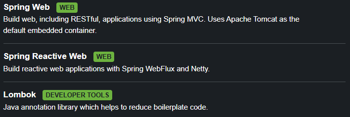
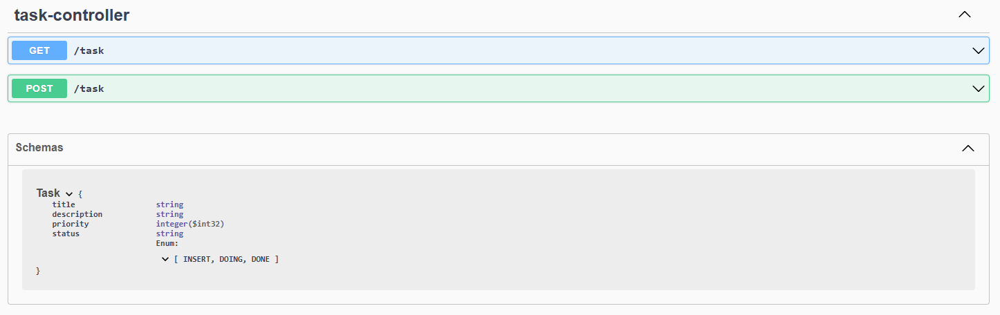

# Task Manager Service 🧑🏽‍💻
**`Em desenvolvimento`**

Este repositório é dedicado ao desenvolvimento de um sistema avançado de gerenciamento de tarefas. O objetivo é ir além do simples acompanhamento de informações básicas, incorporando funcionalidades como o registro de localização em tempo real.

O sistema será projetado para ser robusto e escalável, capaz de lidar com um grande volume de tarefas simultaneamente. Para isso, utilizará uma arquitetura reativa com processamento assíncrono por meio de mensageria, garantindo alta performance e resiliência.

**Neste projeto, irei aprofundar meus conhecimentos em:**
<ul>
<li>Spring Boot.</li>
<li>Mensageria Assíncrona com Apache Kafka.</li>
<li>Persistência NoSQL com MongoDB.</li>
<li>Refatoração de Objetos com Converters.</li>
<li>Prevenção de Falhas com Validations.</li>
<li>Programação Reativa com WebFlux.</li>
<li>Consumo de APIs Externas.</li>
<li>Cobertura de Testes com JUnit.</li>
<li>Padrão de Projeto Builder.</li>
</ul>

--- 

### 🚀 Tecnologias e Ferramentas

---
### 💉 Dependências 

---
### ⚙️ Controller

